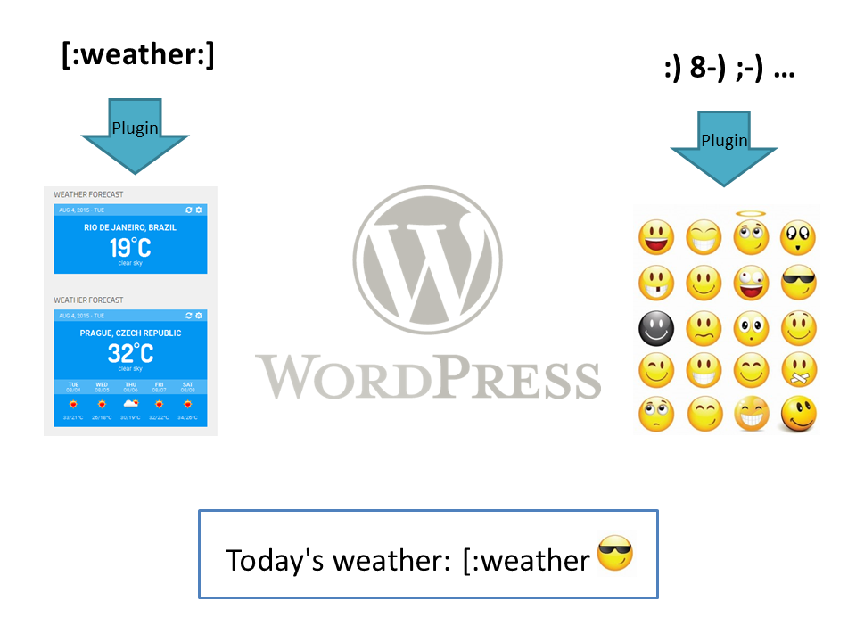
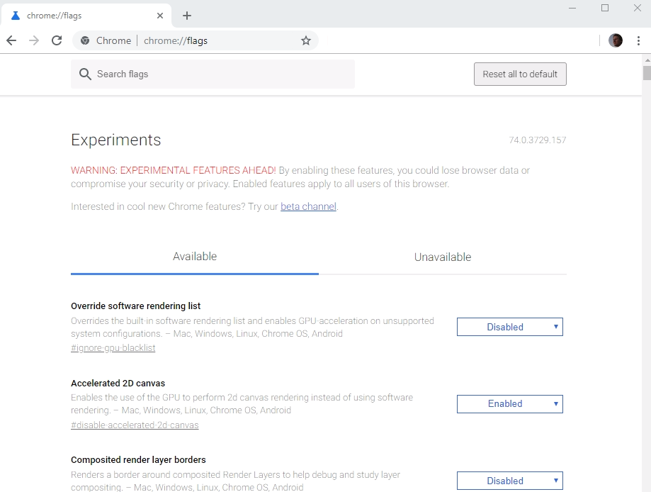
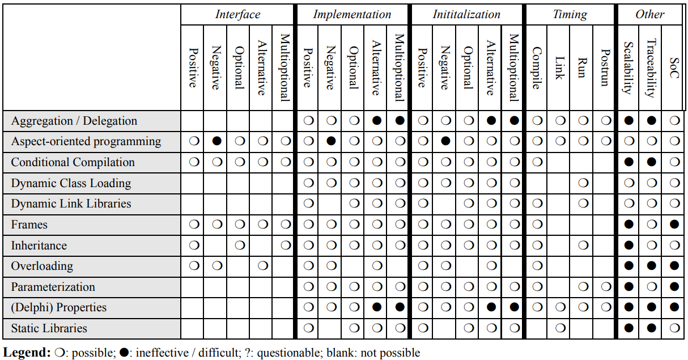
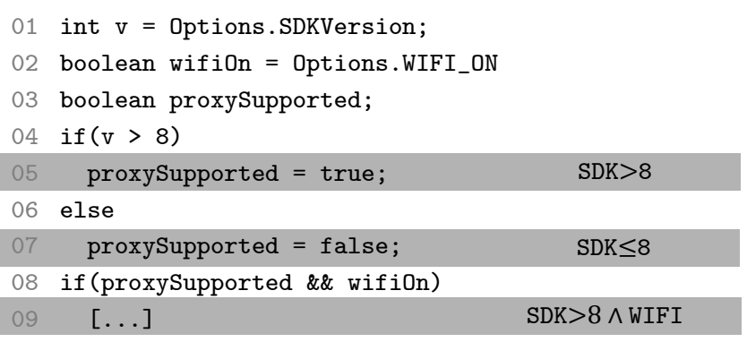

---
link-citations: true
title:  Feature Flags vs Configuration Options -- What's Really New?
---
<style>.figure img{width:100%} .caption{text-align: center; font-style: italic;} code{   font-size: large;   line-height: 120%;}</style>


Having spent over a decade researching configurable systems and software product lines, the phenomenon of feature flags is interesting but also deeply familiar. After reading papers and blogs, watching talks, and interviewing several developers, we see some nuance but also many issues that we had thought were solved long ago. 


Several research communities have looked into features, flags, and options: In the 90s researchers were investigating feature interactions in telecommunication systems and were worried about weird interaction bugs stemming from compositions of optional features. The product line community has developed notations and tools for modeling and reasoning about variability at scale (thousands of options) and has discussed implementation, testing, and analysis strategies for systems with planned configurations. The systems community has investigated how the number of options seem to only ever grow and how users are increasingly frustrated with overwhelming configuration spaces, but also how to diagnose, fix, or even prevent configuration mistakes. For feature flags, we now see all those discussions again: too many flags, hard to remove, hard to test, surprising interaction faults, ...


Let us share some thoughts and a (probably biased) overview of the research landscape:


## Feature Interactions and Complexity


Feature interactions (long studied not only on telecommunication systems []), occur when two options together behave different from what could be expected from each of them individually. There are many well known examples:


* A fire and a flood control system in a building can both be installed and tested independently, but if combined without understanding their interactions, the flood control system may shut down water to a building on fire after the fire control system activates the sprinklers (a form of resource conflict with one feature interfering with the behavior of the other).
* Call waiting and call forwarding can be both independently developed and activated, but how to handle an incoming call on a busy line is unclear when both are activated (two features competing on the same event).
* Plugins in a software system can be developed and tested independently, but may not always work in all combinations. For example, two WordPress plugins that transform the blog post by inserting smileys or weather forecasts may capture overlapping parts of the post:





Feature interactions are a failure of compositionality. Developers think of two features as independent and develop and test them independently, but when composed surprising things may happen. Often interactions are actually intended (true orthogonality is rare) and extra coordination mechanisms are needed, such as priority mechanisms (e.g., fire control overwrites flood control; weather tags are translated before smiley tags, etc). Coordination is easy once interactions are known, however finding and understanding interactions is nontrivial, especially when features are developed separately and there are no clear specifications. We will come back to this later.


**Combinatorial explosion challenges program understanding:** Each decision in the code doubles the number of paths the program can take. Developers have a really hard time reasoning about large configuration spaces. Recent studies have shown that as few as three configuration options can make it really hard for developers to correctly understand the behavior of 20 line programs [@melo2016does]. Although one might argue that the number of combinations does not matter as long as the set of configurations is limited and the options have a fixed values, developers may not have the benefit of such understanding and face code with many decisions. Thus, each additional feature impacts a developers productivity, especially if we are talking about thousands of features. 


**Key differences and insights: Adding options or flags is always challenging for understanding, maintenance, and quality assurance. Feature flags are no exception. Unexpected feature interactions among options can be really tricky to find and can have severe consequences. **


## Temporary vs Permanent Flags


The term **feature flag** (or toggle) is used very broadly for many different concepts. They are popular for controlling *code paths in operation* (A/B testing, canary releases, rollouts and rollbacks) and for *hiding incomplete implementations* while committing to head (avoiding branches and merge conflicts), as well as for *traditional configuration settings* (setting parameters, enabling functionality for certain users, etc). 


The research community around configurable systems and product lines use the terms *configuration option* or *feature* and focus mostly on the latter problem. Configuration options are often used in a similar way, though usually they are *intended to stick around* (several researchers found that configuration options are rarely removed), whereas some (but not all) feature flags are *intended to be removed after a feature is completed, tested, and deployed*. Feature flag removal and technical debt around unremoved feature flags seems to be a key (process) challenge.


Research in configurable systems has shown that options are also often added and rarely removed and that too many options produce significant maintenance and support costs [@xu2015hey; @LSBCW:SPLC10]. It's cheap to introduce an option, but potentially expensive to maintain. If end users can configure the system it can be very difficult to ever get rid of options that some users might use (though in practice there is often little evidence who uses what).


Since the values of feature flags and their rationale for introducing them is often known, there are great opportunities here to track feature flag use better and introduce mechanisms for removal. Discipline in how feature flags are implemented and documented can simplify management and removal, as discussed below. 


**Key differences and insights: Feature flags are often temporary, but removing them is a common process challenge, causing technical debt, that hasn't been a focus of previous work on configurable systems.**


## Who is Making Configuration Decisions?


In the world of product lines and configurable systems, one key distinction that drives many other considerations, especially testing (see below), is who is in charge of configuring the system:


* **Developers/operators configure:** In many traditional software product lines, a company releases a small to medium number of distinct products (e.g., different printers for HP, different releases of Windows with different features). Sometimes, features are activated for paying customers only. In these cases, developers or operators are in charge of configuring the system and users just receive the configured (and hopefully tested) configuration. For example, HP's printer firmware has over 2000 boolean flags, but the company releases only around 100 configurations which each go through CI before release. 
* **Users configure:** Most end-user software and system software has dozens or even thousands of configuration options that users can use to customize the software. For example, end users can use graphical interfaces to change various options in Firefox or Chrome, specify hundreds of parameters in Apache's httpd.conf configuration file, or select from about 14000 compile-time options when they compile their own Linux kernel. When configuration is in the user's hands, it is unpredictable which configurations will actually be used. In most cases (except for web-based systems and systems with good telemetry), we may not even know which configurations are used. 


This has profound consequences for testing, because we can focus on a few known configurations in the first case, but may want to make assurances for all potential configurations a user may select.


Feature flags again somehow touch both of these worlds. Most feature flags seem to be clearly in the "operators configure" world. When used for A/B testing, canary releases, or to hide unfinished features, they are controlled by the operations team and the used configurations are (or should be) known. However, feature flags are sometimes also used for experimental releases that end users can configure (e.g., Chrome's `chrome://flags/`, see @rahman2016feature), blurring the distinction.





Being in control of the configuration has major advantages: One can observe which configurations are used, e.g., monitor which flags have not been changed in weeks. One does not have to care about all the combinations of flags that are not actually used (well, only somewhat, as discussed below). And one can actually remove flags without having to fear to break user configurations.


**Key differences and insights: Developer/operator controlled options have many advantages and most feature flags fall into this category. Be explicit about and limit which flags can be configured by end users.**


## Binding Times


A key distinction in implementing configuration options is what *binding times* are supported, i.e., when the decisions are made. Several papers have discussed different implementation mechanisms and their corresponding binding times [e.g., @SGB:SPE05; @fospl; @KAK:ICSE08; @MP:NOD03; @generativeprogramming; @AG:SSR01].


* **Compile-time binding:** Options are set when the project is compiled and not changed afterward. A specific configuration is thus compiled, tested, and deployed. For example, preprocessor `#ifdef` statements are often used to *exclude code at compile time*. Various code composition approaches have been suggested to separate feature implementations in distinct modules, but it's just as well possible to use constants and normal `if` statements in the implementation, or configuration files that don't change after compilation. Even when normal `if` statements are used, compilers can potentially optimize the code and remove infeasible paths (from simple optimization to partial evaluation [@J:CSUR96; @partialEvaluationBook]).
* **Load-time binding:** Options are loaded (e.g., from command-line options or configuration files) when the program starts; from the perspective of a running program they are essentially constants. This is extremely common and usually very simple to implement. However, since configuration options may be set after compilation, it is less common to rigorously test all used configurations in a CI process or similar.
* **Run-time variability:** Options may change at runtime, typically when the user changes values in a configuration dialog (e.g., Firefox settings) or, more common for feature flags, when a configuration value is queried through an API from a service and changes at some point (often homegrown solutions or services like [LaunchDarkly](https://launchdarkly.com/) and [split](https://www.split.io)). The advantage is that options can be changed in long-running processes without restarting, but the disadvantage is that it is much harder to ensure consistency and avoid stale values (see @toman2016staccato and @toman2018legato for mechanisms to detect such issues). Sometimes it's easier to ask users to restart the system after a configuration change; for short running processes serving web requests it's also easier to essentially assume load-time variability for every request.


Most research on configurable systems focuses on compile-time or load-time variability. For example, there is a huge amount of research on `#ifdef`s and module composition mechanisms. Runtime variability seems less common and seems often not worth the extra challenges. For feature flags, consider whether load-time rather than runtime variability is feasible to reduce complexity and the chance of inconsistent states. 





A key consideration is the interaction of binding times with testing. Traditionally, automated testing is performed after compilation (i.e., for each compile-time configuration), but rarely for each load-time or run-time configuration decision. 


**Key differences and insights: Feature flags mostly use run-time bindings, but often load-time or even compile-time bindings are sufficient and simpler.**


## Tracing Feature Flags (Flag to Implementation Mapping)


How does one find all the code related to an option or flag? In some cases it's trivial: find the `#ifdef` or `if` statement that checks a well-named flag and a few statements guarded by it. But things can quickly get complicated.


First, the flow from where an option's value is read to where it is used is not always obvious or easy to trace in an automated fashion. Options are often loaded into configuration options (e.g., hashmaps) or propagated across function calls and various variables.


Second, even when only few statements in a method are directly guarded by a flag, these few statements can of course invoke lots of other code elsewhere, that might not obviously be associated with this feature flag--that is, there can be large parts of the code (entire classes, modules, dependencies) that are essentially dead code unless a feature flag is enabled, but that mapping might not always be obvious. Also the extra statements may introduce unusual or complex control flows (e.g., exceptions) that are not easily recognized (our own study has shown that developers often make such mistakes when asked to identify all code belonging to an option [@LKB:TSE18]). Finally, code guarded by flags can change various values that are then used later in other places to trigger other `if` statements or cause various forms of changes and interactions. 





Lots of research on configurable systems and product lines has shown that options often have *fairly limited effects* and *do not interact with most other options*, but also that effects of options are often not strictly local and often cause indirect effects through data flows [@MWKTS:ASE16]. Several researchers have developed *analysis tools to track configuration options across various data and control flows*, for example, to approximate possible interactions, detect the scope of an option's implementation, or detect dependencies among options [@LKB:TSE18; @NBKC:TSE15; @Xu:2013:BUM:2517349.2522727; @angerer2015configuration; @MWKTS:ASE16; @SMNKd:GPCE18; @TLSS:EUROSYS11; @zhang2014configuration; @xu2015systems].


**Disciplined option implementation:** Tracing and analysis can be much simplified if *discipline* is used for implementing options. A key hygiene strategy is to *separate configuration options as much as possible from other computations in the program*; that is, avoid using options as input parameters to more sophisticated implementations, but rather mostly propagate them to the `if` statement where they make a decision. *Clear naming conventions* can help as well. Keep implementations corresponding to an option confined in a clear place and document unusual control or data flows. It might be worth investing in writing custom simple static analysis tools or even language mechanisms or libraries that enforce a separation of configuration mechanisms and program logic.


**Modularity / abstraction / encapsulation:** A common suggestion from the product line community for reducing the complexity if to separate the implementation of features from the rest of the program, thus, to *localize or modularize features* [@KAO:FOSD11]. Many researchers have even explored dedicated language mechanisms (feature modules, aspects, delta modules), but they have never seen much adoption in practice and have various problems of their own [@fospl;@BSR:TSE04]. A similar suggestion from our observations on feature flags is to hide features behind abstractions. This, however, adds boilerplate for each flag, which also needs to be removed after the flag is established. Especially for short-term feature flags it might be okay to skip the abstraction step and use a simple but disciplined mechanism to focus on long-term code quality and easy flag removal.


Our standing hypothesis is that most developers already follow a fairly strong discipline for configuration options and pursue locality of options, because they still want to be able to reason about their work. Options that all interact and are hidden in complicated data-flows are difficult to reason about for humans and analysis algorithms alike due to the combinatorial explosion of possible combinations and corresponding code paths. One can make the lives easier for both by enforcing discipline.


**Key differences and insights: Identifying how flags relate to implementations can be surprisingly complicated, but discipline in the implementation, separating configuration logic from program logic, can make both manual and automated analyses much easier.**


## Removing Feature Flags


In traditional configurable systems, where users may change configuration options, it is often difficult to decide when an option can be removed, because it is usually not clear which options users actually use or even depend on. In product lines, where the producer maintains a finite list of configurations, removal is easier but often not done because developers may argue an option might still be useful for future product configurations. This may change significantly for feature flags, where at least some flags are intended to be short lived.


The technical part of removing options from an implementation has been studied and several tools have been built. In theory it could be as simple as removing an `if` statement, but if the scope of the implementation is not well understood it is easy to make mistakes. Even for `#ifdef`s the task turned out more complicated as one might expect due to possible data-flow among options with `#define` and `#undef` statements [@BM:WCRE01]. Conceptually, removing an option is merely a form of partial evaluation [@partialEvaluationBook] where a program is specialized for known values of certain options, but in practice few practical tools exist for removing options and developers rarely go through the effort.


To make it easier for developers to remove feature flags, it might be useful to invest in building own tools that make such removal easy. To gain confidence that such tools work reliably, it is again useful to have clear conventions for feature flags and limit implementations to few specific patterns.


**Key differences and insights: The problem of removing a flag from an implementation is conceptually well understood (partial evaluation), but not many practical tools are available. (Semi-)automated removal becomes much easier with more disciplined implementations.**


## Documenting Feature Flags


For the product line community, features are a central mechanism for communication, planning, and decision making. Much effort is taken to explicitly *document features* (or options) and *their dependencies*. The description of features, their possible values, and their constraints is explicitly separated from the actual values chosen for any specific configuration. Simple notations such as *feature diagrams* (e.g., see @B:SPLC05 or [FeatureIDE](http://www.featureide.com/)) are widely adopted to group and document features and especially to describe constraints on possible configurations (most prominently documenting multiple features to be optional, mutually exclusive, depending on another, or in a hierarchical relationship where child features depend on parent features). Clear documentation of constraints enables automated reasoning and checking of configurations.


Beyond tools focused more on product lines like [FeatureIDE](http://www.featureide.com/) or [pure::variants](https://www.pure-systems.com/), a great example is the Linux kernel's variability model [@SLBWC:VaMoS10], for which the kernel developers have developed their own domain-specific language to describe and document options and an [interactive configurator](https://en.wikipedia.org/wiki/Menuconfig) to select configurations that adhere to all constraints. This is used for some 14000 configuration options in the kernel alone.
```
menu "Power management and ACPI options"
    depends on !X86_VOYAGER
    config PM
        bool "Power Management support"
        depends on !IA64_HP_SIM
        ---help---
        "Power Management" means that . . .
    config PM_DEBUG
        bool "Power Management Debug Support"
        depends on PM
    config CPU_IDLE
        bool "CPU idle PM support"
        default ACPI
    config PM_SLEEP
        bool
        depends on SUSPEND || HIBERNATION || XEN_SAVE_RESTORE
        default y
...
endmenu
```
These kconfig files are part of the Linux kernel source tree and versioned with git (e.g., for [mm](https://github.com/torvalds/linux/blob/master/mm/Kconfig) submodule). Specific configurations are simple option value mappings in a separate file that can be generated and checked by tools that process the kconfig language. 


Academic research has invested a considerable amount of effort into tools that can work with such documented feature models, for example, detecting inconsistencies among constraints [@B:SPLC05; @BSR:IS2010], analyzing the evolution of model changes [@LSBCW:SPLC10; @TBK:ICSE09], resolving conflicts in configurations [@xiong2015range], or guiding humans through the configuration process [@SRG:VAMOS11; @hubaux2013supporting].


In our interviews, we saw that documentation and description of dependencies is likely the place where feature flag practitioners most lack behind the product line community and use often at most ad-hoc mechanisms and sparse comments spread across various configuration or source files. In configurable systems more broadly, there is also less consensus on how to specify, load, and document options [@sayagh2017does; @sayagh2018software].


While documentation is often disliked, it is essential for configuration options, because values are often chosen by stakeholders who have not originally created the option and dependencies among options must be enforced, which can be easily missed if options are only added to a text file with a one-line comment at best. A central configuration model also ensures that all options are documented in a single place, rather than scattered across dozens of files or different mechanisms. A single configuration mechanism can be used across different implementation strategies and binding times. Of course, it should undergo version control just as all other parts of the implementation.


Intentions about defaults and life-time of an option can be used for further automation, such as reminding developers to remove a flag after 1 month or after successful deployment.


Finally, documentation and implementation of features may drift apart. For example, researchers have found flags in the Linux kernel implementation that can never be enabled, as well as documented flags that are never used in the implementation [@TLSS:EUROSYS11]. It is typically a good idea and easy to implement a static consistency check that assures that only documented options can be used in the implementation and that all options are used somewhere. In addition, more advanced static analyses have been developed in academia to identify dependencies among features from the implementation and check whether those align with the documented constraints [e.g., @NBKC:TSE15].


**Key differences and insights: Documenting flags and their dependencies is important and enables many forms of reasoning and automation. Much can be learned from feature modeling in the product line community.**


## Analysis and Testing


Every boolean configuration option doubles the size of the configuration space and it quickly becomes infeasible to test all possible configurations (320 boolean options result in more possible configurations than there are atoms in the universe; the Linux kernel has 14000 compile-time options alone).


As discussed above, we can distinguish options by who makes the configuration decisions: developers/operators or end users. If developers are in charge we might only care about a few configurations that we release, but if users configure the system we don't know which configurations they choose and have to kind of care about all combinations of options.


Feature flags are typically, but not always under control of the development or operations team. Having control and full knowledge over used configurations is a major advantage and allows much more targeted testing and also allows monitoring of the use of flags, e.g., to suggest when to remove.


But even if the developers or operations team is in charge and feature flags are not exposed to users, one may want to change configurations quickly during operation without going through a full test cycle. Also,  Detecting bugs, e.g., from unintended interactions among flags, or only when a combination of flags is actually used, may trigger some late and more costly fixes and reduces the agility with which configurations can be changed. Still, in most organizations, making sure that each configuration went through CI before it is deployed and ensuring that quick live changes are only allowed among tested configurations are not unreasonable strategies and can be implemented with moderate infrastructure.


In practice, it seems many teams using feature flags make changes to configurations live without testing the specific configurations -- which is dangerous.


If one cares about quality for the entire configuration space, there are a number of approaches. There is a lot of research on giving assurances on the entire space [@TAKSS:CSUR14; @vLJKA:TOSEM18], but the more pragmatic and ready to use approach here is **combinatorial testing** [@NL:CSUR11]: Combinatorial testing selects a small set of configurations, such that every combination of every pair of options is included together in at least one configuration and individually in at least one configuration each. Since a single configuration can cover specific combinations of many pairs at the same time (e.g., a single configuration A, B, !C covers A and B together as well as A without C and B without C), combinatorial testing can typically cover interactions among many options with very few configurations (e.g., 18 test configurations for pairwise coverage of 1000 boolean options). For simple cases without constraints among options, just use the [NIST tables](https://math.nist.gov/coveringarrays/ipof/tables/table.2.2.html), if there are constraints there are many academic and a few commercial tools to explore.


For example, the following table has 8 configurations (rows) that assign configuration values to 15 boolean options A--O. For every pair of options there is always at least one configuration that enables both options together, two that each enable one but disables the other, and one that enables neither:
```
A B C D E F G H I J K L M N O
0 0 1 0 0 0 1 1 1 0 0 1 1 1 1 
0 1 0 1 1 0 0 0 1 1 0 0 0 1 1 
1 0 0 1 0 1 0 1 0 0 0 0 0 1 0 
1 1 1 0 1 1 0 1 1 0 1 1 0 0 0 
1 1 0 0 0 0 1 0 0 1 1 1 1 0 1 
0 0 1 1 1 1 1 0 0 1 1 0 1 0 0 
0 0 0 0 0 0 1 0 0 0 0 0 0 0 0 
0 0 0 1 0 1 0 1 0 1 1 1 1 1 1 
```


Many other strategies to sample configurations for testing have been explored. For example, the Linux kernel team uses a number of hand-curated representative configurations together with a farm of computers that perform testing on random configurations (see https://01.org/lkp/documentation/0-day-test-service). Several studies have compared the ability of different sampling strategies to find bugs in configurable systems [e.g., @MKRGA:ICSE16].


Finally, automated tests are only as good as the executed test suites. It can be a good idea to write feature-specific tests that are only executed if that feature is executed but test the behavior of that feature independent of what other features may be enabled [@NKN:ICSE14; @GDS:ICSE12; @ARTK:COMNET13]. Similarly, it can be useful to write additional assertions in the source code that state assumptions that the feature implementation makes about the state of the system or other features if needed, so that such issues are more likely to be detected during testing.


**Key differences and insights: Testing all configurations is clearly infeasible, but combinatorial testing and other sampling strategies can effectively cover large spaces. **


## What's new?


What are we missing? Are there any fundamentally new challenges or should we just learn from configurable systems? What are tooling challenges, what are process challenges?


We'd be happy to have a larger discussion around configuration options and feature flags. Feel free to reach out via comments below or [email](kaestner@cs.cmu.edu).


## Readings
